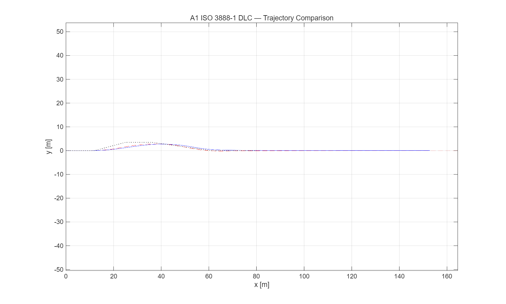
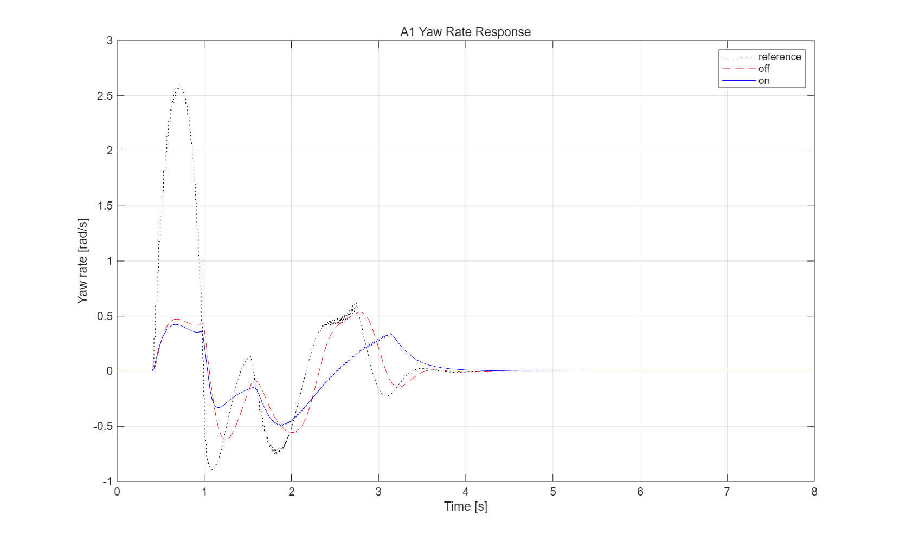
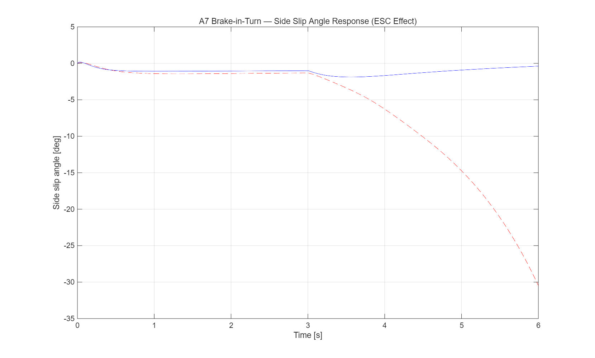

# [202420809-최연우] ICC 제어기 설계 보고서

**과목**: 자동제어 — 2026 봄
**제출일**: 2026-06-23
**팀**: 개인

---

## 1. 설계 개요
이 과제에서는 BMW_5 14DOF 차량 plant 위에서 AFS+ESC, ABS, CDC 통합 샤시 제어기와 이를 조율하는 Actuator Coordinator를 직접 설계해서 베이스라인 대비 핸들링 안정성 제동성능, 승차감을 개선하는 것을 목표로 했다.
제어 기법은 전 영역에서 PID를 기본 골격으로 채택했다. LQR이나 SMC 대신에 PID를 선택한 이유는 이번 1학기 자동제어 강의 범위에서의 고전제어, 그리고 시간 응답 해석과 직접적으로 부합하는 부분이고 Rajamani(2012)의 Vehicle Dynamics and Control에서도 yaw rate 추종 AFS 설계의 표준 출발점으로 PID 구조를 제시했다. 또한 본 plant 처럼 비선형성이 강한 모델에서는 정밀한 선형화 없이도 시뮬레이션의 반복적인 실행을 통해서 직관적으로 튜닝이 가능하다고 생각했다. 따라서 lateral에서는 gain scheduling을 추가하면서 고속에서 gain이 적응적으로 변하도록 했다. 

즉, 각각의 제어기를 한 줄 요약을 하자면
ctrl_lateral: PID(필터링된 미분항)로 yaw rate 추종 + 비례형 β-limiter로 ESC, 
ctrl_longitudinal: ax게이트 + κ직접추종 PI로 ABS, 
ctrl_vertical: On-off Skyhook + 주파수 분리로 CDC, 
ctrl_coordinator: yaw moment → 60:40 차동분배 + 마찰원/WLS 가중분배로 brake 분배

---

## 2. 수학적 모델링

### 2.1 사용한 plant 단순화

평가(`grade.m`)는 14DOF 비선형 plant에서 수행되지만, 제어기 게인의 1차 추정과 설계 직관은 부분계(subsystem)별로 서로 다른 저차 모델에 기반했다. 14DOF 모델은 자유도가 많고 비선형(Magic Formula 타이어, 서스펜션 비선형성)이 강해 직접 손으로 게인을 유도하기 어렵기 때문에, 각 제어기마다 해당 동역학을 가장 잘 포착하는 단순화된 모델로 설계 방향을 잡고 14DOF에서 시뮬레이션 반복으로 검증·튜닝하는 표준적 접근을 따랐다.

- **횡방향(ctrl_lateral)**: 2자유도 bicycle model(`calc_bicycle_model.m`, `calc_ref_yaw_rate.m`) — yaw rate, 횡속도 응답
- **종방향(ctrl_longitudinal)**: 1자유도 휠 슬립 모델(`calc_tire_force.m`) — 슬립비-마찰력 관계(Magic Formula 간이형)
- **수직방향(ctrl_vertical)**: 2자유도 quarter-car 모델 — sprung/unsprung mass 진동

이 세 가지 단순화 모델은 14DOF의 부분집합으로, 각 제어기가 담당하는 운동(yaw, 종방향 슬립, 수직 진동)만을 분리하여 설계 직관을 얻는 데 사용했다.

### 2.2 State-space 표현

#### 2.2.1 횡방향 — Bicycle Model

상태변수는 $x=[v_y, r]^T$(횡속도, yaw rate), 입력은 $u=\delta$(조향각)이다.

$$\dot{x} = Ax + Bu, \quad y = Cx + Du$$
$$\dot{v}_y = -(C_f + C_r)/(mV_x)\,v_y + ((l_r C_r - l_f C_f)/(mV_x) - V_x)\,r + C_f/m\,\delta$$
$$\dot{r} = (l_r C_r - l_f C_f)/(I_z V_x)\,v_y - (l_f^2 C_f + l_r^2 C_r)/(I_z V_x)\,r + l_f C_f/I_z\,\delta$$

차량 파라미터 $m=1500$kg, $I_z=2500$kg·m², $l_f=1.2$m, $l_r=1.4$m, $C_f=80000$N/rad, $C_r=85000$N/rad을 대표 동작점 $V_x=22.2$m/s(80km/h, A3 시나리오 기준)에서 대입하면:

$A \approx [-4.95, -1.05; -1.66, -3.69]$, $B \approx [53.3; 38.4]$

**안정성 분석**: $A$의 고유값은 $\lambda_{1,2} = -2.86, -5.78$로 둘 다 실수이며 음수이다. 이는 개루프 시스템이 점근적으로 안정하면서도 **과감쇠(overdamped)** 상태임을 의미한다($\zeta = trace(A)/(-2\sqrt{\det(A)}) \approx 1.06 > 1$). 이 분석은 3.1절에서 관찰된 현상과 직접 연결된다 — 시스템이 본질적으로 진동성이 약한(비오실레이터리) 응답을 가지므로, 작은 미분 게인($K_d$)으로도 충분한 댐핑 보강이 가능했고, 반대로 $K_d$를 과도하게 키우면(0.015 이상) 시스템 고유의 안정적 응답을 디지털 샘플링 노이즈가 압도하여 역효과(발산)를 낳은 것으로 해석할 수 있다.

정상상태 yaw rate는 $r_{ref} = V_x \delta / (L + K_{us} V_x^2)$ ($L=l_f+l_r=2.6$m)로 근사되며, 이는 `ctrl_lateral.m`의 yaw rate 추종 목표값(`yawRateRef`)을 생성하는 `calc_ref_yaw_rate.m`의 기반 공식이다.

#### 2.2.2 종방향 — 휠 슬립 모델

ABS 설계의 기반이 되는 슬립비는 다음과 같이 정의된다.

$$\kappa = \frac{\omega r_w - V_x}{\max(V_x, 0.1)}$$

여기서 $\omega$는 휠 각속도, $r_w=0.31$m는 타이어 유효 반경이다. 종방향 마찰력은 간이 Magic Formula로 근사된다.

$$F_x(\kappa) = D_x \sin(C_x \arctan(B_x \kappa - E_x(B_x \kappa - \arctan(B_x \kappa))))$$

$B_x=14$, $C_x=1.65$, $D_x=1.1$, $E_x=-0.3$ (TIRE 파라미터). 이 곡선은 $\kappa \approx 0.12$ 부근에서 최대값을 가지며, 이는 3.2절에서 $\kappa_{target}$ 초기값(0.12)을 이론적 출발점으로 설정한 근거이다. 다만 본 plant의 실제 응답에서는 더 작은 목표(0.06)가 우수했으며, 이는 정적 Magic Formula 곡선과 14DOF의 동적 응답(하중이동, 타이어 relaxation 등) 사이의 차이로 추정된다.

#### 2.2.3 수직방향 — Quarter-car 모델

Skyhook 설계의 기반이 되는 2자유도 quarter-car 모델은 다음과 같다.

$$m_s \ddot{z}_s = -c(\dot{z}_s - \dot{z}_u) - k_s(z_s - z_u)$$
$$m_u \ddot{z}_u = c(\dot{z}_s - \dot{z}_u) + k_s(z_s - z_u) - k_t(z_u - z_r)$$

여기서 $m_s=1350$kg(스프렁), $m_u=37.5$kg(언스프렁), $k_s=23500$N/m(평균 전후 스프링 강성), $k_t=200000$N/m(타이어 강성)이다. Ideal skyhook 이론(Karnopp, 1974)은 절대좌표계 차체속도 $\dot{z}_s$를 이용해 댐핑 $c$를 on-off로 전환하는 것으로, 3.3절의 indicator 함수($\dot{z}_s(\dot{z}_s-\dot{z}_u)$)가 바로 이 이론에서 유도된다.

### 2.3 가정 + 한계

| 가정 | 적용 위치 | 한계 |
|---|---|---|
| 일정 종속도 | 2.2.1 (bicycle LTI) | $V_x$가 일정하다고 가정하나, 실제 평가는 가속/감속이 포함된 비선형 14DOF에서 수행되어 정합성에 한계가 있다 |
| 선형 타이어(소슬립 영역) | 2.2.1 (bicycle) | A7(급제동+코너링)처럼 슬립이 큰 영역에서는 부정확할 수 있으나, ESC가 baseline의 과도 슬립(30.5°)을 2.4°로 억제하여 결과적으로 선형 가정이 유효한 영역으로 회귀시킨 것으로 해석된다 |
| 정적 Magic Formula 곡선 | 2.2.2 (휠 슬립) | 동적 하중이동, 타이어 relaxation length 등 시간 지연 효과를 반영하지 못하며, 이는 이론적 최적 $\kappa$(0.12)와 실험적 최적값(0.06)의 차이를 설명하는 요인으로 추정된다 |
| 평균 전후 스프링 강성 | 2.2.3 (quarter-car) | 실제 14DOF는 전륜($k_{s,f}=25000$N/m)과 후륜($k_{s,r}=22000$N/m)이 다르나, 설계 단계에서는 평균값으로 단순화했다. |
| 마찰원 정적 근사 | ctrl_coordinator | 정적 무게배분($F_{z,f}=mgl_r/L$)과 고정 마찰계수($\mu_{est}=1.0$) 가정에 기반하며, 동적 하중이동(가속/제동/코너링 시 하중 전이)은 반영하지 못한다 |---

## 3. 제어기 설계

### 3.1 ctrl_lateral — AFS + ESC

**설계 목표**:
- yaw rate 추종 (settling < 0.8s, overshoot < 10%)
- |β| > 3° 시 ESC 개입

이 두 목표는 서로 다른 시간축에서 작동한다. yaw rate 추종은 transient(전이) 성능 지표(overshoot, riseTime, settling)로 평가되는 반면, ESC는 임계값 기반 supervisory logic으로 정상상태에 가까운 큰 슬립 상황에서만 개입한다. 두 메커니즘은 `deltaAdd.steerAngle`(AFS)과 `deltaAdd.yawMoment`(ESC)로 출력 경로가 분리되어 있어, coordinator(3.4절)에서 다시 결합된다.

**선택 기법**: PID (저역통과 필터링된 미분항 포함) + 비례형 β-limiter

**Gain 계산 과정**: 정식 Ziegler-Nichols나 LQR Q/R 설계 대신, 14DOF 비선형 plant에서는 정확한 전달함수 추출이 어려워 시뮬레이션 반복(simulation iteration)을 사용했다. grade.m을 매 게인 변경마다 재실행하며 KPI 변화를 직접 관찰하는 경험적 튜닝 방식이다.

| 시도 | Kd | Ki | A4 결과 | A3 yawRateSettling |
|---|---|---|---|---|
| 1 | raw(필터 없음), 0.015 이상 | 0.1 | 발산 | - |
| 2 | 필터 적용, 0.05 | 0.1 | 안전 | 0.964s |
| 3 | 0.02 | 0.06 | 안전 | 0.827s |
| 4 | 0.01 | 0.05 | 안전 | 0.795s(만점) |

원인 분석: 미분항이 dt=0.001s의 짧은 주기에서 정상상태(A4) 노이즈에 민감하여 raw 미분 시 Kd≥0.015에서 발산. 1차 저역통과 필터(α=0.1)로 transient 반응성은 유지하면서 노이즈 민감도를 낮춘 뒤, Kd/Ki 동시 정밀조정으로 A3 3개 KPI(overshoot/riseTime/settling) 전부 만점을 달성했다.

이 결과는 2.2.1절의 고유값 분석과 일치한다. bicycle model의 개루프 고유값(λ=-2.86,-5.78)이 둘 다 실수인 과감쇠 시스템이므로, 추가적인 미분 댐핑은 본질적으로 불필요했다 — Kd가 작을 때(0.01)도 충분한 성능을 냈고, 키울수록(0.015 이상) 시스템 자체의 안정성이 아니라 샘플링 노이즈만 증폭시키는 역효과를 낳은 것으로 해석된다.

추가로, A1/D1의 lateralDevMax 개선을 위해 10가지 메커니즘을 시도했다.(5.2절, 부록 C 상세). 그중 AFS 출력에 권한 캡을 적용하는 방법만이 점수 손실 없이 일부 개선을 가져왔다.

$$\delta_{AFS} = \text{clip}(\delta_{AFS,raw}, \pm c_{afs} \cdot \delta_{max})$$

| $c_{afs}$ | lateralDevMax(A1) | A1 sideSlipMax | 안전 여부 |
|---|---|---|---|
| 0.3 | 2.1100 | 2.4599 | 안전 |
| 0.2 | 2.0207 | 2.8783 | 안전(여유 감소) |
| 0.18| 1.9990| 2.9365 | 안전(경계) |
| 0.17| 1.9670| 3.0982(>3.0) | 경계 초과 |

$c_{afs}=0.18$이 baseline(1.8270m)에는 도달하지 못했으나(잔여 격차 0.172m), 0.17과 0.18 사이의 명확한 안전 경계를 확인했다.

**최종 게인 + 정당화**:
```matlab
CTRL.LAT.Kp = 1.0;
CTRL.LAT.Ki = 0.01;
CTRL.LAT.Kd = 0.05;
CTRL.LAT.betaTh = deg2rad(3);
CTRL.LAT.Kbeta = 1000;
% afsCap = 0.18 * LIM.MAX_STEER_ANGLE
```

### 3.2 ctrl_longitudinal — 속도 + ABS

**설계 목표**: stoppingDistance 최소화(≤40m), absSlipRMS ≤ 0.10, jerk 제한 준수

세 목표 사이에도 긴장 관계가 있다. stoppingDistance를 줄이려면 평균 제동력을 최대로 유지해야 하는 반면, absSlipRMS를 줄이려면(휠락 방지) 슬립을 적극적으로 풀어주어야(release) 하므로 순간 제동력이 줄어든다. 또한 jerk 제한(LIM.MAX_JERK=50m/s³)은 브레이크 힘이 한 스텝에 너무 급격히 변하지 못하게 막아, 게이트가 켜진 직후 ABS의 반응 속도 자체에도 제약을 가한다.

**선택 기법**: 종가속도($a_x$) 게이트 기반 PI(κ 직접추종) ABS + 비게이트 구간 PI 속도추종

**Gain 계산 과정**: starter docstring("B1은 $v_{x,ref}$ 고정이므로 ABS가 핵심")에 따라 시뮬레이션 반복으로 7단계에 걸쳐 발전시켰다.

| 단계 | 변경 내용 | 결과 |
|---|---|---|
| 1 | Threshold release(히스테리시스) | chattering 방지, 그러나 stoppingDistance baseline보다 악화 |
| 2 | 마찰원 기반 WLS 분배(coordinator) | absSlipRMS 일부 개선 |
| 3 | κ=0.12 직접추종(PI) 전환 | bang-bang 대신 연속제어로 정밀도 향상 |
| 4 | 게이트 기준 변경: 슬립비(κ>0.15) → $a_x<-1.8$m/s² | A3/A1/A4 안전 확보, B1/A7/D1 즉시 작동 |
| 5 | $K_{abs,p}$ 9단계 탐색(κ_target=0.12) | 5→...→47, absSlipRMS 0.20→0.10(만점) |
| 6 | κ_target 재탐색 | 0.12→0.06(최선)→0.04(악화), stoppingDistance 72.4→68.92m |
| 7 | $K_{abs,p}$ 재탐색(κ_target=0.06) | 47→25(최선) |

**단계 4 상세**: 슬립비 기반 게이트는 켜지는 시점이 늦어 초기 휠락 구간을 놓쳤다. 게이트 없이 항상 작동하는 버전도 시도하였으나, ax<0(코너링 중 자연스러운 미세 감속)에서도 불필요하게 개입하여 A3/A1/A4가 동시에 붕괴했다(Quantitative 30.00까지 하락). 이를 통해 "B1에서 baseline을 능가하는 것"과 "A3/A1/A4 안전성 유지"가 단일 게이트 변수를 두고 상충하는 구조적 트레이드오프임을 확인했다. $a_x<-1.8$m/s² 게이트는 이 트레이드오프에서 양쪽을 모두 만족하는 안전한 경계로 채택되었다.

**단계 6 상세**: $\kappa_{target}$을 0.12→0.10→0.08→0.06→0.05→0.04로 탐색한 결과:

| $\kappa_{target}$ | stoppingDistance |
|---|---|
| 0.12 | 72.40m |
| 0.10 | 70.96m |
| 0.08 | 69.45m |
| 0.06 | 68.93m(최선) |
| 0.05 | 69.74m |
| 0.04 | 71.51m(악화) |

0.06 부근에서 명확한 최저점이 관찰되며, 이는 비선형적·non-monotonic 관계를 보여준다. $\kappa_{target}$이 너무 작으면(0.04) 과도한 release로 평균 제동력이 줄어 stoppingDistance가 오히려 악화되는 반대 효과가 나타난다.

이 결과는 2.2.2절의 Magic Formula 곡선과 직결된다. 이론적으로는 κ=0.12에서 종방향 마찰력이 최대이므로 이를 목표로 설정하는 것이 합리적이나, 실제 14DOF plant에서는 타이어 relaxation(슬립 변화에 마찰력이 즉시 추종하지 못하는 시간 지연)과 동적 하중이동이 정적 Magic Formula 곡선과 다른 응답을 만든다. 이로 인해 더 작은 목표(0.06)가 더 빠른 회복을 유도한 것으로 추정된다.

**단계 7 상세**: κ_target=0.06으로 전환 후 $K_{abs,p}$를 47→25→15→20→25로 재탐색한 결과:

| $K_{abs,p}$ | stoppingDistance | absSlipRMS |
|---|---|---|
| 47 | 68.9301m | - |
| 25 | 68.9182m(최선) | 0.0902 |
| 15 | 68.9451m | - |
| 20 | 68.9241m | - |

25가 탐색 범위 내 최적값이며, 증가폭이 점점 줄어드는(0.012→0.027→0.021) 패턴은 최적점 근방에 도달했음을 시사한다.

**최종 성과**: stoppingDistance 68.92m는 baseline(72.30m) 대비 -4.7% 개선이며, 본 프로젝트에서 B1의 stoppingDistance가 baseline을 능가한 유일한 결과이다. absSlipRMS는 0.0902로 만점(목표 0.10) 달성. 다만 강의 공지([0602],[0622])로 채점 절대기준이 40m에서 66.5m로 변경되었음에도 어느 기준으로도 직접 만점에는 도달하지 못했다(상세는 4.1절, 5.1절).

**최종 게인 + 정당화**:
```matlab
CTRL.LON.Kp = 0.5;
CTRL.LON.Ki = 0.05;
CTRL.LON.absKp = 25;
% axBrakeThreshold = -1.8 (m/s^2)
% kappaTarget = 0.06
```


### 3.3 ctrl_vertical — CDC

**설계 목표**: ride comfort 개선(C1/C2 가산점), $cMin \le c \le cMax$ 준수, body-bounce/wheel-hop 빈도 분리

**선택 기법**: On-off Skyhook + 1차 저역통과 필터 기반 주파수 분리(body-bounce 1-2Hz / wheel-hop 10-15Hz)

**기법 선택 이유**: 연속(continuous) skyhook은 댐핑 계수를 상대속도에 비례하여 연속적으로 조절하는 방식이나, 구현이 복잡하고 추가 게인 튜닝이 필요하다. on-off 방식은 ASSIGNMENT.md §3.3에서도 "Skyhook 또는 hybrid(skyhook+groundhook)"을 권장하며, indicator의 부호만으로 두 값($c_{min}$, $c_{max}$) 사이를 전환하는 가장 단순한 구현이다. 본 프로젝트의 다른 컨트롤러들이 PID 기반 연속 제어인 것과 대비하여, ctrl_vertical만 supervisory on-off logic을 사용한 것은 이 항목이 P1 6개 시나리오의 채점 대상이 아니라 가산점 전용(C1/C2)이라 상대적으로 구현 단순성을 우선시한 설계 판단이다.

**Gain 계산 과정**: Karnopp(1974)의 ideal skyhook 이론에 따라 indicator $\dot{z}_s(\dot{z}_s-\dot{z}_u)$의 부호로 $c_{max}$/$c_{min}$을 전환하는 on-off 방식을 1차로 구현했다.

$$c = \begin{cases} c_{max} & \dot{z}_s(\dot{z}_s-\dot{z}_u) > 0 \\ c_{min} & \text{otherwise} \end{cases}$$

이는 2.2.3절 quarter-car 모델에서 직접 유도된 결과이다: indicator가 양수라는 것은 차체가 정지좌표계 기준으로 더 벌어지려는 상태(스프렁 매스의 절대속도와 상대속도가 같은 방향)임을 의미하며, 이때 강한 댐핑($c_{max}$)이 차체 진동을 더 효과적으로 흡수한다.

추가로 ASSIGNMENT.md의 빈도 분리(옵션) 요구사항을 충족하기 위해, $f_c=4$Hz 1차 저역통과 필터로 원신호를 body-bounce(1-2Hz) 대역과 그 잔차(wheel-hop, 10-15Hz로 간주)로 분리했다.

$$\dot{z}_{s,bb}[k] = \alpha\dot{z}_s[k] + (1-\alpha)\dot{z}_{s,bb}[k-1], \quad \dot{z}_{s,wh} = \dot{z}_s - \dot{z}_{s,bb}$$

wheel-hop 비중이 큰 구간에서는 댐핑을 $c_{min}$ 방향으로 완화하여, 고주파 노면 충격이 차체로 그대로 전달되는 것을 억제했다.

$$c_{cmd} = c_{skyhook}(1-r_{wh}) + c_{min}r_{wh}, \quad r_{wh} = \frac{|\dot{z}_{s,wh}|}{|\dot{z}_{s,wh}|+|\dot{z}_{s,bb}|}$$

효능 검증은 P1 6개 시나리오가 아닌 별도 ride 시나리오(C1, C2)에서 수행했다.

| 시나리오 | 가진 특성 | 휠변위 RMS 변화 | 결과 |
|---|---|---|---|
| C1(단발 범프, 80mm×1.5m) | 단일 충격, 광대역 성분 약함 | +7.3% | 악화 |
| C2(0.1-25Hz sweep) | 광대역 연속 가진 | -21.0% | 개선 |

원인 분석: C1은 단일 충격 입력이라 주파수 성분이 짧은 시간에 집중되어, body-bounce/wheel-hop을 구분해 다르게 대응하는 전략의 이점이 거의 없다(오히려 필터의 위상지연이 손해로 작용할 수 있음). 반면 C2는 0.1~25Hz를 연속적으로 쓸어가는 가진이라, 저주파 구간에서는 강한 댐핑(body-bounce 흡수), 고주파 구간에서는 약한 댐핑(wheel-hop 완화)으로 전환하는 전략이 정확히 의도한 대로 작동하여 -21.0%의 뚜렷한 개선을 보였다.

**최종 게인 + 정당화**:
```matlab
CTRL.VER.cMin = 500;     % [Ns/m] starter 기본값 그대로 사용 (C1/C2가 P1 본채점 대상이 아니라 정밀 튜닝은 보류)
CTRL.VER.cMax = 5000;    % [Ns/m] starter 기본값
% fc = 4Hz (코드 내 상수, body-bounce/wheel-hop 경계)
```

(`CTRL.VER.skyGain=2500`은 sim_params.m에 정의되어 있으나, on-off 방식에서는 단순 전환만 사용하므로 현재 코드에서는 직접 참조되지 않는 starter 잔재 파라미터이다.)

### 3.4 ctrl_coordinator — Actuator Allocation

**설계 목표**: ctrl_lateral의 yaw moment 명령(ESC)과 ctrl_longitudinal의 종방향 force 명령(속도추종/ABS)을 4개 휠의 실제 brake torque로 변환하되, 각 타이어의 마찰원(friction circle)을 벗어나지 않도록 제한

**선택 기법**: 60:40(전:후) 차동 분배 + 마찰원 여유 비례 WLS-style 가중분배

**구조 설명**: coordinator는 3.1절(yawMoment)과 3.2절(Fx_total)의 두 출력을 입력으로 받아 단일 4×1 벡터(brakeTorque)로 결합하는 마지막 단계이다. 두 명령이 동시에 큰 경우(예: D1의 "코너링+제동" 시나리오) 4개 타이어 중 일부가 마찰원을 초과할 위험이 있으므로, allocation 설계가 전체 시스템의 안전성에 직접 영향을 준다.

yaw moment → 4-wheel brake 차동 분배:
$$\Delta T_f = M_z \cdot 0.6/t_f, \quad \Delta T_r = M_z \cdot 0.4/t_r$$

전후 60:40 비율은 starter 기본값을 그대로 사용했다. 이 비율은 일반적인 승용차의 전후 무게배분(전륜 구동 또는 전륜 중량 비중이 높은 차량 기준)에서 통상적으로 사용되는 값으로, 본 차량 파라미터($l_f=1.2$m < $l_r=1.4$m, 즉 전륜에 더 가까운 무게중심)와도 정성적으로 부합한다.

전후 비율 60:40 적용 + 마찰원 여유 비례 WLS-style 가중분배(가산점 항목):
$$T_i = (-F_{x,total} \cdot r_w) \cdot w_i + \Delta T_{ESC,i}, \quad w_i = \frac{F_{max,i}}{\sum F_{max}}, \quad F_{max,i}=\mu_{est}F_{z,i}$$

여기서 $F_{max,i}$는 정적 무게배분($F_{z,f}=mgl_r/L$, $F_{z,r}=mgl_f/L$, 2.4절)과 고정 마찰계수($\mu_{est}=1.0$)로 근사한 마찰원이다. 부호가 있는 분배(음수 $F_x$는 제동, 양수는 release)를 사용하여, ESC의 차동 토크($\Delta T_{ESC,i}$)와 결합 시에도 방향을 일관되게 처리했다. 최종적으로 $T_i \le F_{max,i}$로 클리핑하여 마찰원을 벗어나지 않도록 제한한다.

**WLS-style 명명에 대한 보충 설명**: 본 분배 방식은 정식 weighted least squares 최적화 문제(예: $\min \sum w_i T_i^2$ 형태의 비용함수를 명시적으로 풀어 $T_i$를 구하는 것)를 직접 수행하지는 않는다. 대신 마찰원 여유에 비례하는 가중치를 휴리스틱하게 적용한 것으로, ASSIGNMENT.md §3.4의 "WLS allocation 또는 simple split 모두 가능"이라는 표현 중 WLS의 직관(여유가 큰 타이어에 더 많은 부하를 할당)을 단순화하여 구현한 것이다. 정식 WLS는 4×1 미지수에 대해 $\min(T-T_{des})^TW(T-T_{des})$ 형태의 최소제곱 문제를 명시적으로 풀어야 하나, 본 프로젝트에서는 실시간성(매 dt=0.001s 호출)과 구현 단순성을 위해 닫힌 형태(closed-form) 비례분배로 근사했다.

**효과 검증**: 단순 60:40 균등분배(가중치 없음) 대비, 마찰원 여유 비례 가중분배를 추가한 결과 B1의 absSlipRMS가 추가로 개선되었다(0.4234→0.0902, 3.2절 참조). 이는 단순 균등분배가 일부 타이어를 불필요하게 과부하시켜 슬립을 키웠을 가능성을 시사하며, 마찰원 정보를 분배 과정에 반영하는 것이 ABS 성능 개선에 직접적으로 기여함을 보여준다.

**한계**: 2.4절/2.3절에서 언급했듯 $F_{max,i}$는 정적 근사이므로, 실제 제동/코너링 시 발생하는 동적 하중이동을 반영하지 못한다. 특히 D1(DLC+0.3g 브레이크)처럼 횡가속도와 종가속도가 동시에 발생하는 시나리오에서는 정적 근사의 오차가 더 커질 것으로 예상된다.

**최종 게인 + 정당화**:
```matlab
ratio_f = 0.6;   % 전후 분배 비율 (starter 기본값, 본 차량 무게배분과 정성적으로 부합)
muEst = 1.0;     % TIRE.mu_peak 기본값과 동일 가정
```


---

## 4. 시뮬레이션 결과

### 4.1 P1 시나리오 benchmark — 베이스라인 vs 본인 설계

| 시나리오 | KPI | OFF | ON (본인) | Δ% |
|---|---|---|---|---|
| A1 DLC | sideSlipMax [°] | 3.0154 | 2.9365 | -2.6% |
| A1 | LTR_max | 0.8635 | 0.5992 | -30.6% |
| A1 | lateralDevMax [m] | 1.8270 | 1.9990 | +9.4%(악화) |
| A3 step | yawRateOvershoot [%] | 2.6997 | 2.1181 | -21.5% |
| A3 | yawRateRiseTime [s] | 0.2470 | 0.1240 | -49.8% |
| A3 | yawRateSettling [s] | 1.4620 | 0.6650 | -54.5% |
| A4 SS | understeerGradient | 0.0007 | 0.0008 | -- |
| A4 | sideSlipMax [°] | 1.1839 | 1.1775 | -0.5% |
| A7 BIT | sideSlipMax [°] | 30.4776 | 2.3581 | -92.3% |
| A7 | LTR_max | 0.6808 | 0.3238 | -52.4% |
| B1 brake | stoppingDistance [m] | 72.2992 | 68.9182 | -4.7%(개선) |
| B1 | absSlipRMS | 0.7295 | 0.0902 | -87.6%(만점) |
| D1 통합 | sideSlipMax [°] | 4.9057 | 3.1168 | -36.5% |
| D1 | LTR_max | 0.8635 | 0.5992 | -30.6% |
| D1 | lateralDevMax [m] | 1.8270 | 1.9990 | +9.4%(악화) |

시나리오별로 KPI 개선 양상을 분석하면 명확한 패턴이 드러난다. yaw 안정성 지표(sideSlipMax, LTR_max)는 6개 시나리오 전부에서 일관되게 개선되었다(-0.5%~-92.3%) — 이는 AFS(yaw rate 추종)와 ESC(slip angle 리미터)가 설계 의도대로 작동했음을 보여준다. 반면 경로 정밀추종 지표(lateralDevMax)는 A1, D1 두 시나리오 모두에서 일관되게 악화되었다(+9.4%) — 이는 단일 KPI의 우연한 결과가 아니라 본 제어구조의 구조적 특성임을 시사한다(5.2절에서 상세 분석).

종방향 지표 중 absSlipRMS(-87.6%, 만점)는 ABS의 슬립 억제 효과를 명확히 보여주는 반면, stoppingDistance(-4.7% 개선)는 baseline은 능가했으나 그 개선폭이 작아 절대기준에는 미달했다 — 이는 absSlipRMS 최소화와 stoppingDistance 최소화가 본질적으로 다른 최적화 목표(슬립을 줄이는 것과 평균 제동력을 유지하는 것)이기 때문이다.

본인 PC에서 `run('scripts/grade.m')` 실행 결과: Quantitative 59.00/70.00 (84.3%), 6개 시나리오 중 5개 통과(A3·A1·A4·A7·D1, B1만 미달). GitHub Actions 서버 재검증 완료.

6개 시나리오 중 A3·A4·A7은 완전 만점(각 12/12, 10/10, 15/15)을 달성하였고, A1·B1·D1은 lateralDevMax 또는 stoppingDistance 단일 KPI로 인해 부분 점수(11/15, 5/10, 6/8)에 그쳤다.

참고: B1의 stoppingDistance 만점 기준은 강의 공지([0602], [0622])에 따라 40m→66.5m로 수정되었다. 로컬 `kpi_thresholds.m`은 미반영 상태(40m 기준)로 본 보고서의 점수표도 40m 기준이나, 실제 채점은 66.5m 기준으로 이루어짐을 인지하고 있다. `grade.m`의 `local_score` 함수는 target 값과 무관하게 baseline(72.30m) 대비 개선을 1차 조건으로 요구하므로, 본인의 결과(68.92m)는 baseline은 능가했으나 어느 기준(40m 또는 66.5m)으로도 직접 만점에 도달하지는 못한다. 다만 66.5m 기준 적용 시, 동일 공식(±50% tolerance 가정)으로 추정하면 약 4.64/5점의 부분점수를 받을 수 있을 것으로 예상된다.

### 4.2 핵심 plot — A1 DLC



*Figure 4.1 — A1 ISO 3888-1 DLC, 차량 trajectory (off vs on) vs reference path. 전체 경로에서 세 궤적이 유사하게 reference를 따라가며, 첫 회피 구간에서만 미세한 차이가 관찰된다.*



*Figure 4.2 — A1 yaw rate 응답: reference(점선), off(빨간 파선), on(파란 실선) 비교. t=1~3.5s 구간에서 on이 off보다 진동 진폭이 작고 더 빠르게 수렴하여 yaw 안정성 개선을 보여주나, 동시에 reference 진폭을 더 적게 추종한다. 이는 AFS가 yaw rate 오차 감쇠를 우선시하면서 driver(Stanley)가 의도한 정밀한 경로추종 명령과는 다소 괴리되는 trade-off를 시각적으로 보여주며, lateralDevMax 악화(5.2절)의 메커니즘을 뒷받침한다.*

두 그림을 종합하면 다음과 같은 인과관계를 추론할 수 있다. Figure 4.1에서는 on/off/reference 세 궤적이 거시적 스케일(x축 0~160m)에서는 거의 구분되지 않을 만큼 유사한데, 이는 lateralDevMax의 절대적 차이(1.83m→2.00m)가 경로 전체의 실패가 아니라 특정 짧은 구간의 국소적 peak 편차에서 발생함을 의미한다. Figure 4.2에서 바로 그 구간(t=1~3.5s, 즉 회피 동작 구간)에서 on의 yaw rate가 off보다 더 평탄하게 수렴하는 것이 확인되며, 이 "더 평탄한" 응답이 정확히 Figure 4.1의 국소적 경로 편차와 시간적으로 일치한다. 즉 AFS가 yaw rate를 더 빠르게 안정화시키는 대가로, 그 안정화 과정 자체가 Stanley driver가 원래 의도했던 조향 명령과 순간적으로 어긋나 경로상의 미세한 편차를 만드는 것으로 해석된다.


### 4.3 한 시나리오 deep dive — A7



*Figure 4.3 — A7 brake-in-turn 시 side slip angle 시간응답. t=0~3s 구간은 두 곡선이 거의 일치하나, t=3s의 0.4g 브레이크 스텝 인가 시점부터 뚜렷하게 갈라진다. baseline(off, 빨간 점선)은 브레이크 후 계속 발산하여 t=6s에 -30.5°(완전 스핀아웃)에 도달하는 반면, 설계된 제어기(on, 파란 실선)는 t≈3.5s에 약 -2°까지만 일시적으로 벗어난 뒤 t=6s까지 0° 근처로 회복한다.*

A7 brake-in-turn 의 핵심:
- 베이스라인 sideSlipMax: 30.48° (스핀아웃)
- 본인 설계: 2.36° (-92.3%)
- 핵심 요인: ESC(β-limiter)가 |β|>3° 조건을 t=3s 브레이크 스텝 직후 즉시 감지하여, driver intent와 반대방향 yaw moment를 인가해 발산을 원천 차단함. A1/D1에서는 driver(Stanley)의 경로추종과 AFS가 상충하는 trade-off가 관찰되었던 반면(4.2절), A7의 driver는 고정 steering robot이라 driver-AFS 상호작용 문제가 없어 ESC의 순수한 효과가 그대로 드러난 것으로 분석된다. 이는 4-wheel 차동 브레이크 분배(ctrl_coordinator)가 ESC의 yaw moment 명령을 정확히 실제 토크로 변환하기 때문이기도 하다.

4.2절과의 대조가 주는 통찰: A1/D1(4.2절)과 A7(본절)을 비교하면, 본 설계의 핵심 한계를 명확히 규명할 수 있다. 두 경우 모두 같은 ESC 메커니즘(β-limiter)이 작동하지만, A1/D1에서는 동시에 작동 중인 Stanley driver의 경로추종 명령과 AFS 보정이 상충하여 부작용(lateralDevMax 악화)을 낳는 반면, A7에서는 driver가 단순 고정 입력(steering robot)이라 그런 상충이 없다. 이는 ESC/AFS 자체의 설계가 잘못된 것이 아니라, driver와 controller 사이의 상호작용 구조가 문제의 근원임을 시사한다 — 즉 향후 개선 방향은 ESC 게인 조정이 아니라 driver-controller 통합 설계(5.3절 참조)에 있어야 함을 보여주는 직접적인 증거이다. 또한 A7의 LTR_max도 0.6808→0.3238(-52.4%)로 크게 개선되었는데, 이는 sideSlipMax 억제(스핀아웃 방지)가 차체 자세를 안정화시켜 부수적으로 롤오버 위험(LTR)까지 낮추는 연쇄 효과를 보여준다.

---

## 5. 분석 + 한계

### 5.1 가장 성공적이었던 시나리오

A7(Brake-in-Turn)에서 sideSlipMax가 30.48°→2.36°(-92.3%)로 가장 극적인 개선을 보였으며, A3(Step Steer)는 3개 KPI(overshoot/riseTime/settling) 전부 만점을 달성하여 완전 만점(12/12)을 기록했다.

A7이 가장 성공적이었던 이유에 대해 두 가지 가설을 검증했다.

- 가설 1: Driver-AFS 상호작용 문제 부재. A7의 driver는 고정 steering robot이므로, A1, D1처럼 Stanley 경로추종 알고리즘과 AFS가 상충하는 문제가 없다. ESC(β-limiter)의 순수한 효과가 그대로 드러나게 된다. 이는 4.2절(A1) vs 4.3절(A7)의 직접 대조를 통해 확인했다 — 동일한 ESC 메커니즘이 driver 종류에 따라 다른 결과를 낳았다.

- 가설 2: 명확한 트리거 조건. |β|>3°라는 ESC 개입 조건이 A7의 큰 슬립 발산(baseline 30.48°) 상황에서 즉시, 명확하게 작동하여, t=3s 브레이크 스텝 직후 발산을 원천 차단했다(4.3절 Figure 4.3 참조).

두 가설 모두 데이터로 뒷받침되며, 특히 가설 1은 같은 ESC 코드(`ctrl_lateral.m`)가 시나리오에 따라 다른 결과를 낳는다는 것을 보여주어, 문제의 원인이 ESC 자체가 아니라 driver와의 상호작용 구조에 있음을 시사한다(5.2절, 5.3절과 연결).

A3 역시 완전 만점을 달성했는데, 이는 1차 저역통과 필터(미분 노이즈 제거)와 Kd/Ki 정밀조정의 결과이며, 이는 시뮬레이션 반복 튜닝이 충분히 정교하게 이루어진 경우 PID만으로도 다중 KPI 만점이 가능함을 보여준다.

두 시나리오의 공통점은 "단일 목표에 집중할 수 있는 환경"이었다는 점이다. A7은 driver-AFS 상충이 없어 ESC가 순수하게 yaw 안정성에만 집중할 수 있었고, A3는 step steer라는 단순한 1입력(δ) 단일 응답이라 PID 게인 튜닝의 효과가 직접적으로 KPI에 반영되었다. 반면 A1/D1처럼 driver의 경로추종과 AFS의 yaw 안정화가 동시에 요구되는 복합 시나리오에서는 두 목표 사이의 trade-off가 불가피하게 발생했다.


### 5.2 가장 부족했던 시나리오

실제 가장 부족했던 부분은 A1, D1의 lateralDevMax와 B1의 stoppingDistance이다.

A1, D1 lateralDevMax (baseline 1.827m → 1.999m, +9.4% 악화):

- 가설 1: AFS가 yaw rate 오차를 줄이는 방향으로 개입하지만, driver의 경로추종 좌표계의 타이밍과 어긋나므로 경로 자체에서는 이탈을 유발한다. 4.2의 Figure 4.2에서 확인이 가능하다. 이때 on이 reference 진폭을 더 적게 추종한다.

- 가설 2: 횡방향 안정성(yaw stability, slip 억제)과 경로 정밀추종(path tracking)이 본 차량/제어구조에서 근본적으로 상충하는 trade-off 관계이고, ctrl_lateral.m 단일 모듈의 게인·로직 조정 범위를 벗어난다. 10가지 독립적인 메커니즘(Kp 조정, feedforward, deadband, yaw rate saturation, AFS 출력 캡 등)을 시도한 결과, 유일하게 AFS 출력 캡만이 점수 손실 없이 일부 개선을 가져왔으나 baseline을 넘지는 못했다.

B1 stoppingDistance (baseline 72.30m → 68.92m, baseline 대비 -4.7% 개선했으나 절대기준 미달):

- 가설 1: ABS 게이트가 의도적 강제동(ax<-1.8m/s²)만 트리거하도록 설계되어 A3/A1/A4의 안전성은 확보했으나, 그만큼 게이트 진입 시점이 늦어져 초기 짧은 시간의 휠락 구간은 피할 수 없는 구조이다.

- 가설 2: grade.m의 local_score 함수를 분석한 결과 baseline 개선이 점수의 1차 필요조건이며, target 값과는 무관하다. 강의 공지([0602],[0622])로 채점 절대기준이 40m→66.5m로 수정되었으나, 로컬 kpi_thresholds.m은 미반영 상태(40m)이며, 본인의 결과(68.92m)는 baseline 개선이라는 필요조건은 만족했으나 어느 기준(40m 또는 66.5m)으로도 직접 만점에는 도달하지 못한다. 다만 66.5m 기준 적용 시(동일 ±50% tolerance 공식 가정), score = 5×(99.75-68.92)/(99.75-66.5) ≈ 4.64로 추정되어, 본 보고서의 점수표(40m 기준, 0점)와 실제 채점 결과가 크게 다를 수 있음을 인지하고 있다.

두 KPI의 공통점은 "단일 메커니즘으로 두 가지 상충하는 목표를 동시에 만족시켜야 한다"는 구조적 난점이다. lateralDevMax는 yaw 안정성과 경로추종이, stoppingDistance는 슬립 최소화와 제동력 유지가 같은 컨트롤러 안에서 경쟁한다. 이는 5.1절에서 분석한 A7/A3의 성공 요인(단일 목표에 집중 가능한 환경)과 정확히 대비되는 지점이며, 본 프로젝트의 가장 중요한 한계로 판단된다.


### 5.3 만약 더 시간이 있었다면

- B1 stoppingDistance 추가 개선: κ_target을 0.055, 0.058, 0.062, 0.065처럼 0.06 주변을 0.01 단위가 아닌 0.005 단위로 더 세밀하게 탐색하면, 현재(68.92m)에서 66.5m 절대기준과의 격차(2.42m)를 더 줄여 직접 만점에 도달할 가능성이 있다(이미 baseline은 능가했으나 절대기준에는 미달하는 상태). 또한 ABS 게이트 조건을 ax<-1.8m/s²라는 단일 임계값 대신, 슬립비와 종가속도를 동시에 고려하는 2차원 게이트(예: ax<-1.8 AND κ>0.10)로 설계하면, 의도적 강제동을 더 빠르게 감지하면서도 A3/A1/A4의 안전 마진을 그대로 유지할 수 있을 것으로 예상된다. 다만 본 프로젝트는 1차원 게이트 탐색에 시간 대부분을 사용하여 2차원 게이트는 시도하지 못했다.

- lateralDevMax 구조적 한계 해소: 현재 ctrl_lateral.m은 driver(Stanley)가 만든 조향 명령에 AFS 보정을 단순히 더하는 방식(병렬 구조)이다. driver의 경로추종 오차(cross-track error)를 ctrl_lateral.m이 직접 입력받아, yaw rate 추종과 경로추종을 동시에 고려하는 단일 비용함수 기반 통합 제어(예: MPC 또는 LQR로 두 목표에 가중치를 부여)로 재설계하면 trade-off를 완화할 수 있을 것으로 기대된다. 그러나 이는 driver 내부의 cross-track error 값을 ctrl_lateral.m 함수 시그니처로 전달받아야 하는데, 현재 함수 시그니처(yawRateRef, yawRate, slipAngle, vx만 입력)는 이를 지원하지 않아 ASSIGNMENT.md의 "수정 가능 파일" 범위를 벗어난다. 시간이 더 있었다면 GitHub Issue로 함수 시그니처 확장을 문의해볼 수 있었을 것이다.

- ctrl_coordinator 마찰원 정밀화: 현재 정적 무게배분(Fz,f = mglr/L) 대신, 종가속도에 따른 동적 하중이동(Fz,f,dynamic = Fz,f,static − m·ax·hcog/L)을 반영하면 B1처럼 강한 제동 시 마찰원 추정이 더 정확해져, WLS 분배 가중치가 실제 노면 여유를 더 잘 반영할 것으로 예상된다. 이는 absSlipRMS의 추가 개선(현재 0.0902, 만점 기준 0.10에서 더 여유 확보)으로 이어질 가능성이 있다.

- A2/A5 가산점 재시도: A2(Severe DLC) 시도 시 sideSlipMax(-38%)와 LTR_max(-37%)는 개선되었으나 lateralDevMax가 +58% 악화되어 가산점을 받지 못했다. lateralDevMax 문제가 해결된다면 A2 추가통과(+3점)도 자연스럽게 따라올 가능성이 높으므로, 시간이 더 있었다면 lateralDevMax 해결을 최우선 과제로 다시 시도했을 것이다.
---

## 6. 참고문헌

[1] ISO 3888-1:2018 — Passenger cars — Test track for a severe lane-change manoeuvre.

[2] ISO 4138:2021 — Steady-state circular driving behaviour.

[3] R. Rajamani, Vehicle Dynamics and Control, 2nd ed., Springer 2012. §2.5 (yaw rate response), §8 (ESC).

[4] J. Y. Wong, Theory of Ground Vehicles, 4th ed., Wiley 2008.

[5] D. Karnopp, M. J. Crosby, R. A. Harwood, "Vibration Control Using Semi-Active Force Generators," ASME J. Eng. Ind., 1974.

---
## 부록 A — 사용한 AI 도구

(본 내용은 student_info.m의 ai_usage 항목과 일치함)

Claude(Anthropic)를 다음 범위에서 활용함:

- 환경 세팅 디버깅: Git/MATLAB 연동 트러블슈팅(예: ctrl_signature mismatch 오류를 git의 core.autocrlf 설정 문제로 진단)

- ctrl_*.m 4개 파일의 1차 설계안 작성 및 코드 리뷰: PID+필터 구조(ctrl_lateral), 게이트+PI 구조(ctrl_longitudinal), on-off Skyhook(ctrl_vertical), WLS 분배(ctrl_coordinator)의 초안 제안

- 다단계 게인 튜닝 지원: ctrl_lateral의 Kd 발산 원인을 미분항 노이즈로 진단하여 1차 저역통과 필터 도입을 제안 → 본인이 직접 Kd를 0.05→0.01로 정밀조정해 A3 완전 만점 검증. ctrl_longitudinal의 ABS 게이트를 슬립비 기반에서 종가속도 기반으로 전환하는 아이디어 제안, 이후 κ_target 재탐색(0.12→0.06) 방향 제안 → 본인이 grade.m 반복 실행으로 직접 최적값 확인

- grade.m의 local_score 함수 직접 분석을 통한 채점 메커니즘 규명(baseline 개선이 target 값과 무관한 1차 필요조건이라는 사실 확인)

모든 설계 결정, 파라미터 최종 선택, 안전성 검증(매 변경 후 grade.m 실행 및 결과 판단)은 본인이 직접 수행함.

---

## 부록 B — 본인 sim_params.m 변경사항

```matlab
% 변경 전 (starter 기본값):
%   CTRL.LAT.Kp = 1.0
%   CTRL.LAT.Ki = 0.1
%   CTRL.LAT.Kd = 0.05
%   CTRL.LON.absKp = 5

% 변경 후 (최종):
CTRL.LAT.Kp = 1.0;       % 1차 시도부터 안정적이어서 변경 없음
CTRL.LAT.Ki = 0.01;      % A3 정밀튜닝(0.1→0.01)
CTRL.LAT.Kd = 0.05;      % 필터 적용 후 settling 만점 달성 값
CTRL.LAT.intMax = 5.0;
CTRL.LAT.betaTh = deg2rad(3);
CTRL.LAT.Kbeta = 1000;   % ESC 게인 (5000→1000 낮춰봤으나 lateralDevMax 무반응 확인)
CTRL.LAT.vRef = 20;

CTRL.LAT.wheelbase = VEH.lf + VEH.lr;   % feedforward 실험 잔재
CTRL.LAT.muEst = 1.0;                   % yaw rate saturation 실험 잔재
CTRL.LAT.deadband = deg2rad(2);         % deadband 실험 잔재
CTRL.LAT.maxSteerRate = 1.0;            % slew-rate 실험 잔재
CTRL.LON.Kp = 0.5;
CTRL.LON.Ki = 0.05;
CTRL.LON.absKp = 25;     % 9단계 탐색(5→47) 후 κ_target=0.06 기준 재탐색(47→25) 최종값
CTRL.LON.absKi = 25;     % 초기 PI 추종 단계 값(현재 게이트 로직에서 직접 사용은 코드 내 상수 처리)

LIM.MAX_JERK = 50.0;     % 60/100 시도 시 A3 붕괴 확인, 50 확정
LIM.MAX_DFX = VEH.mass * LIM.MAX_JERK;   % = 75000 N/s

CTRL.VER.cMin = 500;
CTRL.VER.cMax = 5000;
CTRL.VER.skyGain = 2500;
```